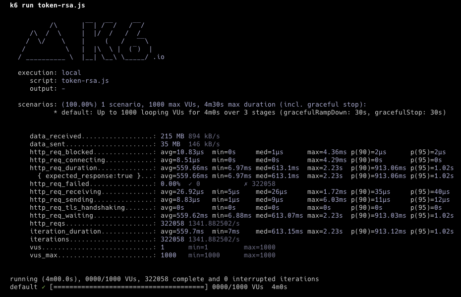
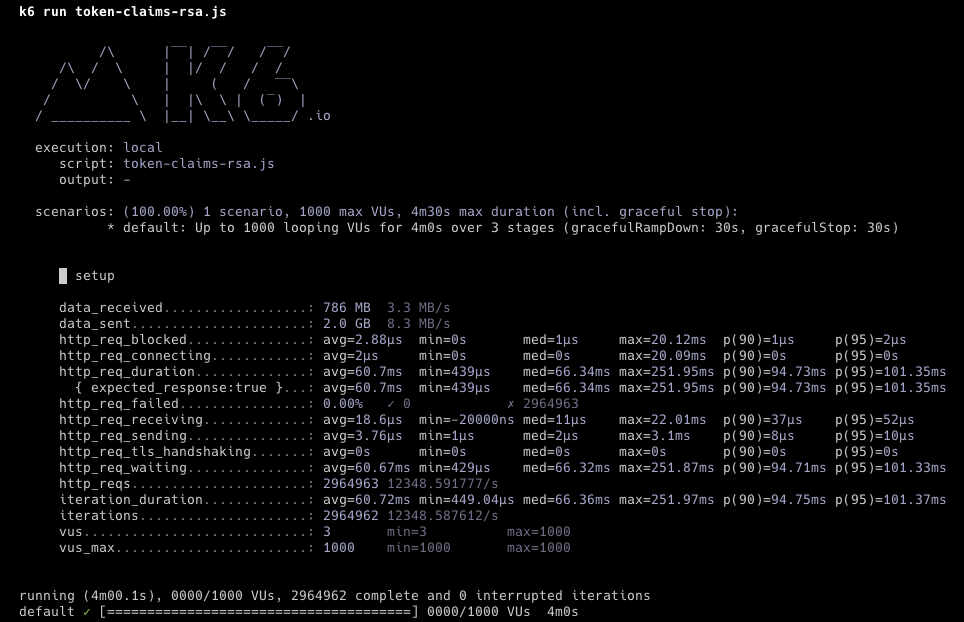
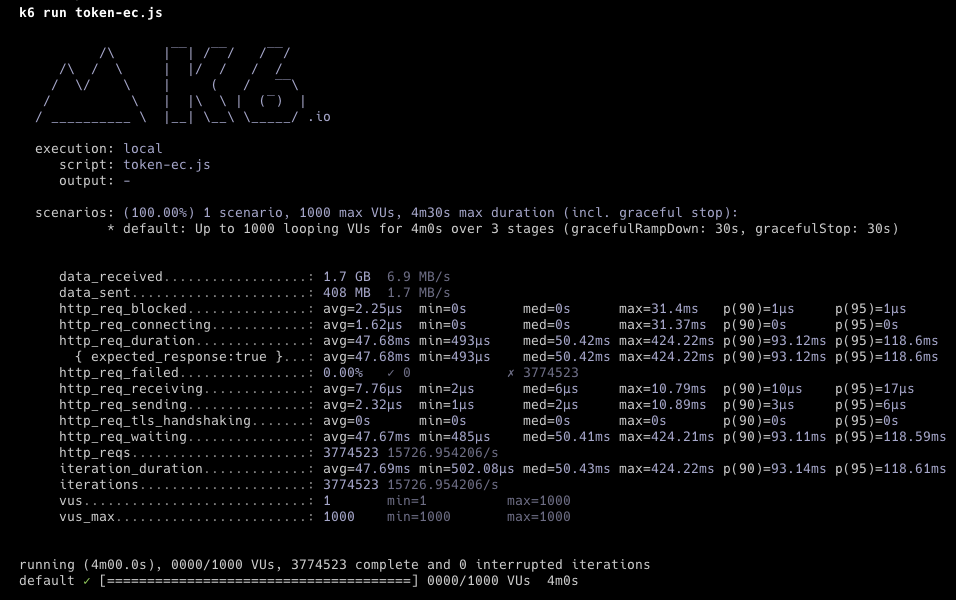
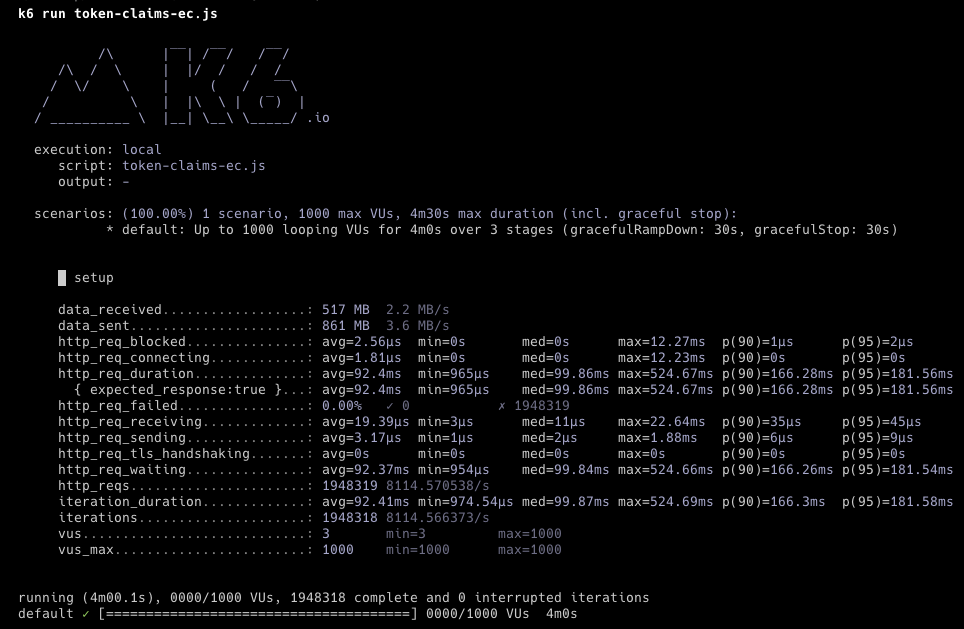

# RSA vs EC
Load tests were performed for RSA (Rivest-Shamir-Adleman) and EC (Elliptic Curve) asymmetric encryption algorithms.

The [k6](https://k6.io/) was used for load testing.

To run the tests, install k6. Then,

``` shell
cd k6-load-test
```

``` shell
k6 run token-rsa.js
```

All tests are in the k6 folder.

All tests were performed by re-running the application each time it was run.

All tested on Macbook M2 Pro 32GB RAM machine.

## RSA
### Generate Token


### Parse Token Claims


## EC
### Generate Token


### Parse Token Claims


## Result
When generating tokens with the RSA algorithm, the number of iterations is 322,058 and the average waiting time is 559.69 ms.

When generating tokens with the EC algorithm, the number of iterations is 3,774,523 and the average waiting time is 47.67 ms.

When parsing token claims with the RSA algorithm, the number of iterations is 2,964,962 and the average waiting time is 60.67 ms.

When parsing token claims with the EC algorithm, the number of iterations is 1,948,318 and the average waiting time is 92.37 ms.

According to the result;

- If there is a system that will generate too many tokens, it seems logical to use the EC algorithm here.

- If there is a system that will parse too many tokens, it seems logical to use the RSA algorithm here.

NOTE: When the token is parsed, the signature is checked.

## References
* https://k6.io/
* https://wiki.openssl.org/index.php/Elliptic_Curve_Cryptography
* http://koclab.cs.ucsb.edu/teaching/ecc/project/2015Projects/Levy.pdf
* https://gist.github.com/gimbimloki/e73bb06fcf89a1ee3954885d5d9857dc
* https://mkjwk.org/